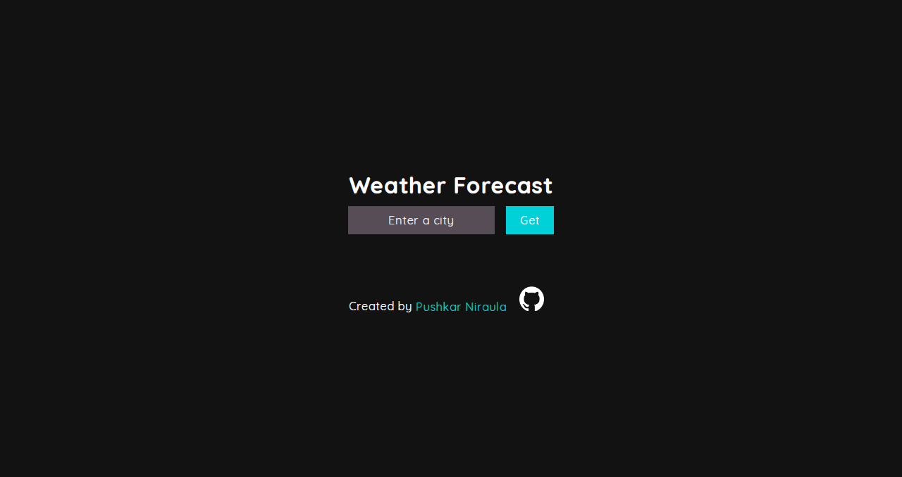
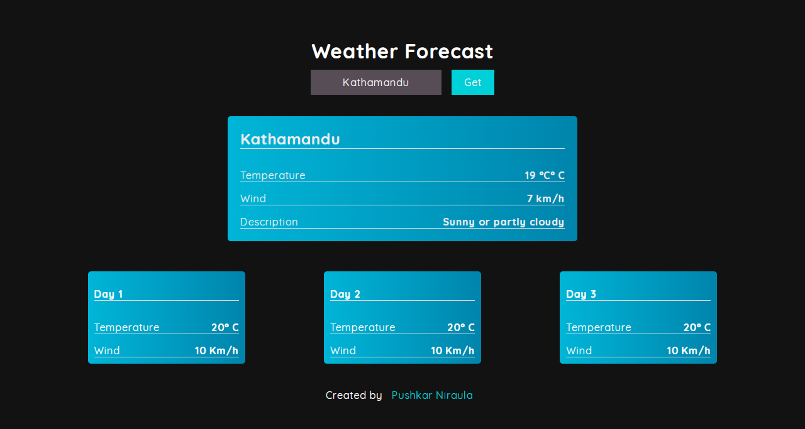

# 3-Day Weather Forecast

This is a simple weather forecast application that uses the **Fetch API** to get the current weather and a 3-day forecast for any city. The data is retrieved from the [GoWeather API](https://github.com/robertoduessmann/weather-api).

## Screenshot




## Features

- Fetches and displays current weather data for the entered city.
- Displays a 3-day weather forecast, including temperature and wind speed.
- Simple and clean user interface with a centered form and result display.

## Installation

1. Clone the repository or download the files:

```bash
    git clone https://github.com/puskar26/weather.git
```

2. Navigate to the project directory:

```bash
    cd weather
```

3.Open `index.html` in a browser: You can directly open the index.html file in your favorite web browser.

Alternatively, you can use a local web server like Live Server (in VSCode) or http-server for Node.js.

## Usage

1. Enter the name of the city for which you want to get the weather data.
2. Click the Get button.
3. The current temperature, wind speed, and description will be displayed.
4. A 3-day weather forecast will also be shown below the current weather data.

## Example

Here’s an example of what the app will display after entering "Kathmandu" as the city name:

```yaml
Kathmandu
Temperature: 20°C
Wind: 10 km/h
Description: Partly cloudy

Forecast:
Day 1:
Temperature: 18°C
Wind: 8 km/h

Day 2:
Temperature: 17°C
Wind: 6 km/h

Day 3:
Temperature: 19°C
Wind: 7 km/h

```

## Project Structure

```
weather/
├── index.html
├── style.css
├── script.js
├── README.md
├── code.md
├── images/
└── favicons/

```

## Technologies Used

- **HTML5**: For the structure and layout.
- **CSS3**: For styling the page.
- **JavaScript (ES6)**: For fetching weather data using the Fetch API.
- **GoWeather API**: Provides weather data in JSON format.

## Credits

The weather data is provided by the GoWeather API, developed by [Roberto Duessmann.](https://github.com/robertoduessmann)

## Author

Created by [Pushkar Niraula](https://www.pushkarniraula.com)

## License

This project is licensed under the MIT License.
